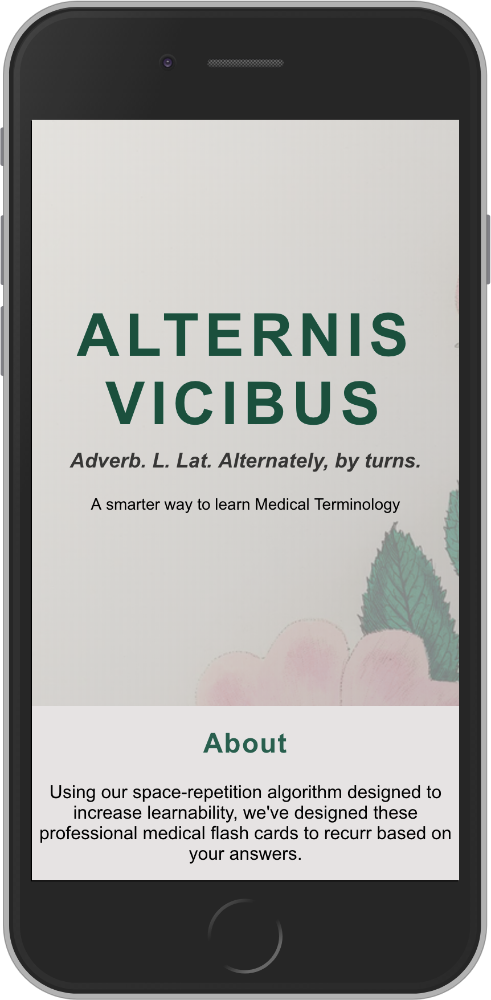

# ALTERNIS VICIBUS:
A simple, smarter way to learn Medical Terminology using spaced repition logic & flashcards

### Tech Stack
**Front End:** 
  - [Create React App](https://github.com/facebook/create-react-app)
  - [React](https://github.com/facebook/react)
  - [React Redux](https://redux.js.org/introduction/getting-started)
  - [CSS](https://developer.mozilla.org/en-US/docs/Web/CSS)

**Back End:** 
  - [Node](https://github.com/nodejs/node)
  - [Express](https://github.com/expressjs/express)
  - [Passport](http://www.passportjs.org/)
  - [MongoDB](https://github.com/mongodb/mongo)
  - [Mongoose](https://github.com/Automattic/mongoose)
  - [mLab](https://mlab.com/)

### Live version: 
- https://alternis-vicibus.herokuapp.com/

### Server Source Code: 
- https://github.com/thinkful-ei26/spaced-rep-jordan-server

### ScreenShot


### API
```
/api
.
├── /auth
│   └── POST
│       ├── /users
│       └── /refresh
├── /users
│   └── POST
│       └── /
├── /questions
│   └── GET
│       ├── /
│   └── PUT
│       ├── /current
│       ├── /unclaim/:userId
```